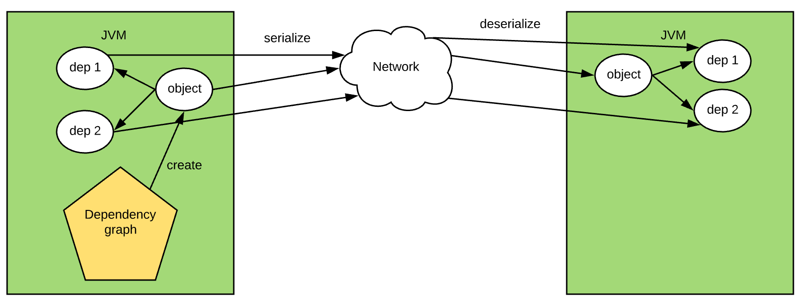
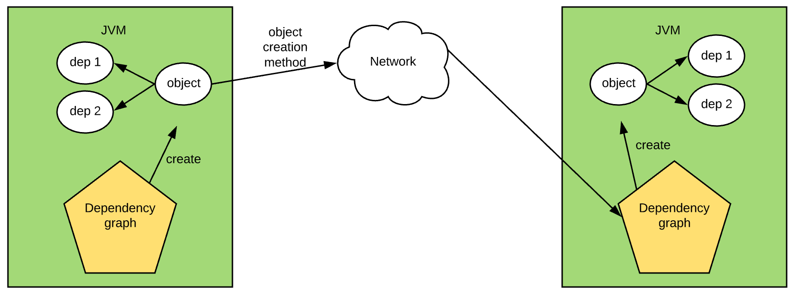

# neutrino

A dependency injection (DI) framework for apache spark

<!-- START doctoc generated TOC please keep comment here to allow auto update -->
<!-- DON'T EDIT THIS SECTION, INSTEAD RE-RUN doctoc TO UPDATE -->
**Table of Contents**  *generated with [DocToc](https://github.com/thlorenz/doctoc)*

- [neutrino](#neutrino)
- [Essential Information](#essential-information)
  - [Binary Releases](#binary-releases)
  - [How to build it](#how-to-build-it)
- [Why it is so difficult to apply DI on apache spark](#why-it-is-so-difficult-to-apply-di-on-apache-spark)
- [What can the neutrino framework do](#what-can-the-neutrino-framework-do)
- [How does the neutrino handle the serialization problem](#how-does-the-neutrino-handle-the-serialization-problem)
  - [Example: handle serialization with serializable proxy](#example-handle-serialization-with-serializable-proxy)
  - [Example: handle serialization with SerializableProvider[T]](#example-handle-serialization-with-serializableprovidert)
  - [Example: bind serializable proxy and provider with annotations](#example-bind-serializable-proxy-and-provider-with-annotations)
  - [Example: recover the job from spark checkpoint](#example-recover-the-job-from-spark-checkpoint)
- [Scopes](#scopes)
  - [Example: Singleton per JVM scope](#example-singleton-per-jvm-scope)
  - [Example: StreamingBatch scope](#example-streamingbatch-scope)
- [Other features](#other-features)
  - [Some key spark objects are also injectable](#some-key-spark-objects-are-also-injectable)
  - [Injector Hierarchy / Child Injector](#injector-hierarchy--child-injector)
  - [Multiple dependency graphs in a single job](#multiple-dependency-graphs-in-a-single-job)

<!-- END doctoc generated TOC please keep comment here to allow auto update -->

# Essential Information
## Binary Releases

You can add the dependency with maven like this:
```xml
<dependency>
    <groupId>com.disneystreaming.neutrino</groupId>
    <artifactId>core_${scalaVersion}</artifactId>
    <version>${sparkVersion}_0.3.3-SNAPSHOT</version>
</dependency>
```

for gradle
```groovy
compile "com.disneystreaming.neutrino:core_${scalaVersion}:${sparkVersion}_0.3.3-SNAPSHOT"
```

for sbt
```scala
libraryDependencies += "com.disneystreaming.neutrino" % "core" % s"${sparkVersion}_0.3.3-SNAPSHOT"
```

The supported values for `scalaVersion` and `sparkVersion` are:

| Name | Values |
|:--:|:--:|
| scalaVersion | 2.11  2.12 |
| sparkVersion | 2.0  2.1  2.2  2.3  2.4   |

## How to build it
```shell
./gradlew clean build -Pscala-version=${scalaVersion} -Pspark-version=${sparkVersion}
```
The default value for `scalaVersion` is `2.11`, and the one for `sparkVersion` is `2.3`.

You can also add an option `-Pfast` to skip all the test cases and code style checks to make the build process faster. 

# Why it is so difficult to apply DI on apache spark

As we know, [dependency injection](https://en.wikipedia.org/wiki/Dependency_injection) (DI) is a famous design pattern that is widely used in Object-Oriented Programming (OOP). It separates the responsibility of "use" from the responsibility of "construction", and keeps modules evolving independently.

There are some mature dependency injection frameworks in the JVM world, such as [Guice](https://github.com/google/guice) and [Spring framework](https://docs.spring.io/spring-framework/docs/current/reference/html/core.html), which are all designed to work properly in a single JVM process.

A spark job is a distributed application that requires the collaboration of multiple JVMs. Under such circumstances, it is so common to pass some object from the driver to executors, and spark requires the passed object and all its direct or in-direct dependencies to be serializable (as described by the following picture), which may need quite a lot of effort. Not to mention if the checkpoint is enabled in spark streaming, more objects need to be serialized. Normal DI frameworks can't handle it for these scenarios.



# What can the neutrino framework do
The neutrino framework is a [Guice](https://github.com/google/guice) based dependency injection framework for apache spark and is designed to relieve the serialization work of development. More specifically, it will handle the serialization/deserialization work for the DI-generated objects automatically during the process of checkpoint recovery and object transmission across JVMs.

The framework also provides some handy DI object scope management features, such as Singleton Scope per JVM, StreamingBatch scope (reuse the object in the same spark streaming batch per JVM).

In addition, the spark key utility objects such as SparkContext, SparkSession, StreamingContext are also injectable, which provides more flexibility for the orchestration of the spark job.

# How does the neutrino handle the serialization problem

As we know, to adopt the DI framework, we need to first build a dependency graph first, which describes the dependency relationship between multiple instances. Guice uses Module API to build the graph while the Spring framework uses XML files or annotations.

The neutrino is built based on [Guice framework](https://github.com/google/guice), and of course, builds the dependency graph with the guice module API. It doesn't only keep the graph in the driver, but also has the same graph running on every executor.



If an object is about to be passed to another JVM, instead of serializing the object and its dependencies, the neutrino framework remembers the creation method of the object, passes the information to the target JVM, and recreates it along with all dependencies with the same dependency graph out there. The object doesn't have to be serializable, all of which is done automatically by the framework.

And there is also another benefit. Before that a new object will be created every time it is passed to the target JVM, but since this approach introduces a single dependency graph in each JVM, the lifetime or scope of the passed objects in the executos can be managed by the graph out there, For example,
- [Singleton per JVM](#example-singleton-per-jvm-scope)
  - If the same object is passed to the target JVM the second time, the existing one could be reused instead of creating a new one.
- [Streaming batch scope](#example-streamingbatch-scope)
  - If the same object is passed to the target JVM the second time within the same streaming batch, the existing one could be reused. Otherwise, an new object will be created.

Here are some examples:

## Example: handle serialization with serializable proxy
Consider such a case that there is an event stream, and we'd like to abstract the logic to filter the stream based on a white list of user ids, which is stored in the redis. Here is how we implement it with the neutrino.

```scala
import javax.inject.Inject
import scala.collection.mutable

case class TestEvent(userId: String)

trait EventFilter[T] {
    def filter(t: T): Boolean
}

// here is the spark job logic
val injectorBuilder = sparkSession.newInjectorBuilder()
val injector = injectorBuilder.newRootInjector(new FilterModule(redisConfig))
injectorBuilder.completeBuilding() // Don't forget to call this before getting any instance from injector

val filter = injector.instance[EventFilter[TestEvent]]
val eventStream: DStream[TestEvent] = ...
eventStream.filter(e => filter.filter(e))

// OR
eventStream
    .filter(e => injector.instance[EventFilter[TestEvent]].filter(e))

// injectable for constructors
class StreamHandler @Inject() (filter: EventFilter[TestEvent]) {
    def handle(eventStream: DStream[TestEvent]): Unit = {
        // assign it to a local variable to avoid serialization for the StreamHandler class
        val localFilter = filter
        eventStream
            .filter(e => localFilter.filter(e))
    }
}
```
Generally, the `EventFilter[TestEvent]` instance must implement the `java.io.Serializable` interface since it is passed from the driver to executors. But with the neutrino framework, we don't need to do that.
```scala
class RedisUserWhiteListsEventFilter @Inject()(jedis: JedisCommands) extends EventFilter[TestEvent] {
    private lazy val userIdSet = {
        jedis.hkeys("users").asScala
    }

    override def filter(t: TestEvent): Boolean = {
        t.userId != null && userIdSet.contains(t.userId)
    }
}

// how to generate the redis connection
case class RedisConfig(host: String, port: Int)
class RedisConnectionProvider @Inject()(redisConfig: RedisConfig) extends Provider[JedisCommands] {
    override def get(): JedisCommands = {
        new Jedis(redisConfig.host, redisConfig.port)
    }
}
```
Here is how we bind the dependencies with the module API extensions introduced in the neutrino framework.
```scala
class FilterModule(redisConfig: RedisConfig) extends SparkModule {
    override def configure(): Unit = {
        bind[RedisConfig].toInstance(redisConfig)
        bind[JedisCommands].toProvider[RedisConnectionProvider].in[SingletonScope]
        // the magic is here
        // The module must extend `SparkModule` or `SparkPrivateModule` to get the method withSerializableProxy
        bind[EventFilter[TestEvent]].withSerializableProxy.to[RedisUserWhiteListsEventFilter].in[SingletonScope]
    }
}
```
The extension method `withSerializableProxy` (provided by `SparkModule` or `SparkPrivateModule`) will generate a serializable proxy with the same interface (`EventFilter[TestEvent]`) to replace the actual binding. This proxy object is small, serializable, and contains the creation info of the target object. When it is used in the driver, it is just a proxy to the actual object, but while passed to the executors, it will create the same object with the dependency graph there after deserialization.

And since the scope for the object `EventFilter[TestEvent]` is `SingletonScope` (singleton per driver and executor JVM), the same object would be reused if there is already one there.

Since the implementation `RedisUserWhiteListsEventFilter` is recreated with the graph per JVM, so all its dependencies even the `JedisCommands` can be injected, which will also be created per JVM according to the binding info defined in the module.

**There is only one limitation** --- all the modules defining the dependency graph have to be serializable (the base class `SparkModule` has already implemented the `java.io.Serializable`), which is rather easy to handle. For the above example, the only thing that needs to be serialized is `RedisConfig`.

## Example: handle serialization with SerializableProvider[T]
The auto-generated serializable proxy assumes the binding type (such as `EventFilter[TestEvent]` in the example above) is an interface (trait for scala) or inheritable class with default constructor. If it is not the case, like some final class or the one without parameterless constructor, the neutrino framework provides a way to get a serializable `SerializableProvider[T]` instance which contains the creation information of the target object, which can be passed across JVMs.

> Note: in native Guice API, we can also get a provider `Provider[T]` for the instance, but the provider is not serializable.

Here is an example:
```scala
final class EventProcessor @Inject()() {
    def process(event: TestEvent): Unit = {
        // processing logic
    }
}

class EventProcessorModule extends SparkModule {
    override def configure(): Unit = {
        bind[EventProcessor].in[SingletonScope]
        
        // enable the injection of SerializableProvider[EventProcessor]
        // The module must extend `SparkModule` or `SparkPrivateModule` to get it
        bindSerializableProvider[EventProcessor]
    }
}

val injectorBuilder = sparkSession.newInjectorBuilder()
val injector = injectorBuilder.newRootInjector(new FilterModule(redisConfig))
injectorBuilder.completeBuilding()

// get the SerializableProvider from the injector directly
val provider = injector.instance[SerializableProvider[EventProcessor]]

eventStream.map { e =>
    provider.get().process(e)
}

// injectable for constructors
class StreamHandler @Inject() (provider: SerializableProvider[EventProcessor]) {
    // class body
}
```

## Example: bind serializable proxy and provider with annotations
As you know, in the Guice framework, we can bind the same type with different annotations to distinguish them ([Guice doc](https://github.com/google/guice/wiki/BindingAnnotations)), and this feature is also supported for serializable proxy and provider, and in fact, the API is very straightforward.

Here is the example for the usage of the serializable proxy with annotations:
```scala
class FilterModule(redisConfig: RedisConfig) extends SparkModule {
    override def configure(): Unit = {
        bind[RedisConfig].toInstance(redisConfig)
        bind[JedisCommands].toProvider[RedisConnectionProvider].in[SingletonScope]
        bind[EventFilter[TestEvent]].annotatedWith(Names.named("Hello"))
            .withSerializableProxy.to[RedisUserWhiteListsEventFilter].in[SingletonScope]
    }

// get the serializable proxy from the injector directly
injector.instance[EventFilter[TestEvent]](Names.named("Hello"))

// injectable for constructors
class StreamHandler @Inject() (@Named("Hello") filter: EventFilter[TestEvent]) {
    // class body
}
```

Here is the example for the usage of `SerializableProvider[T]` with annotations:
```scala
import com.google.inject.name.Names

class EventProcessorModule extends SparkModule {
    override def configure(): Unit = {
        bind[EventProcessor].annotatedWith(Names.named("Hello")).in[SingletonScope]
        
        // enable the injection of SerializableProvider[EventProcessor]
        // The module must extend `SparkModule` or `SparkPrivateModule` to get it
        bindSerializableProvider[EventProcessor](Names.named("Hello"))
    }
}

// get the SerializableProvider from the injector directly
injector.instance[SerializableProvider[EventProcessor]](Names.named("Hello"))

// injectable for constructors
class StreamHandler @Inject() (@Named("Hello") provider: SerializableProvider[EventProcessor]) {
    // class body
}
```

## Example: recover the job from spark checkpoint
Sometimes we need to enable the checkpoint in case of a job failure, which requires any closure object used in the processing logic to be serializable. The neutrino framework would automatically handle the recovering work for the injectors and all objects wrapped with auto-generated proxies or serializable providers. Internally, when the job is recovering, it rebuilds the graph on every JVM firstly, based on which all objects are regenerated.

Here is an example of how to do that:
```scala
import com.disneystreaming.neutrino._

val injectorBuilder = sparkSession.newInjectorBuilder()
val injector = injectorBuilder.newRootInjector(new FilterModule(redisConfig))
injectorBuilder.completeBuilding() // Don't forget to call this before getting any instance from injector

val checkpointPath = "hdfs://HOST/checkpointpath"

// Don't call StreamingContext.getOrCreate directly
val streamingContext = sparkSession.getOrCreateStreamingContext(checkpointPath, session => {
    // Don't call the constructor directly
    val streamContext = session.newStreamingContext(Duration(1000*30))
    streamContext.checkpoint(checkpointPath)
    val eventStream: DStream[TestEvent] = ...
    eventStream
        .filter(e => rootInjector.instance[EventFilter[TestEvent]].filter(e))
    streamContext
})

streamingContext.start()
streamingContext.awaitTermination()
```

A full example can be found [here](./examples/src/main/scala/com/disneystreaming/neutrino/example/StreamingJobWithCheckpoint.scala).

# Scopes
## Example: Singleton per JVM scope
The framework make it possible to keep a singeton object in an executor, which can be really useful in some cases.

For example, if we'd like to send a stream to a Kafka topic, it is necessary to keep a singleton KafkaProducer in each executor. Generally, this can be done with a static varaible or object instance in scala, which is difficult for testing.

But with the neutrino framework, we can easily get that by binding the Producer with a Singleton scope, which is easy for testing and maintenance.

Here is an example:
```scala
import org.apache.kafka.clients.producer.{Producer, ProducerRecord}

trait EventConsumer[T] {
    def consume(t: T)
}

case class KafkaTopic(topic: String)
class KafkaEventConsumer[T] @Inject()(producer: Producer[String, String], kafkaTopic: KafkaTopic) extends EventConsumer[T] {
    override def consume(t: T): Unit = {
        val record = new ProducerRecord[String, String](kafkaTopic.topic, Json.mapper.writeValueAsString(t))
        producer.send(record)
    }
}

stream
    .foreachRDD{ rdd =>
        rdd.foreach(e => injector.instance[EventConsumer[TestEvent]].consume(e))
    }

// OR
val consumer = injector.instance[EventConsumer[TestEvent]]
stream
    .foreachRDD{ rdd =>
        rdd.foreach(e => consumer.consume(e))
    }
```
Here is how to generate the kafka provider and bind these dependencies:
```scala
case class KafkaProducerConfig(properties: Map[String, Object])
class KafkaProducerProvider @Inject()(kafkaProducerConfig: KafkaProducerConfig) extends Provider[Producer[String, String]] {
    override def get(): Producer[String, String] = {
        new KafkaProducer(kafkaProducerConfig.properties.asJava)
    }
}

class ConsumerModule(kafkaProducerConfig: KafkaProducerConfig, topic: String) extends SparkModule {
    override def configure(): Unit = {
        bind[KafkaTopic].toInstance(KafkaTopic(topic))
        bind[KafkaProducerConfig].toInstance(kafkaProducerConfig)
        bind[Producer[String, String]].toProvider[KafkaProducerProvider].in[SingletonScope]

        bind[EventConsumer[TestEvent]].withSerializableProxy.to[KafkaEventConsumer[TestEvent]].in[SingletonScope]
    }
}
```

## Example: StreamingBatch scope
If we evolve the example of event filter a little, say the user white list in the redis is changeable, and we'd like to update the white list data in every batch. To achieve this goal, all we need to do is to bind the instance with a different scope.
```scala
class FilterModule(redisConfig: RedisConfig) extends SparkModule {
    override def configure(): Unit = {
        // the same as the above example
        bind[RedisConfig].toInstance(redisConfig)
        bind[JedisCommands].toProvider[RedisConnectionProvider].in[SingletonScope]
        // just change the scope from SingletonScope to StreamingBatch
        bind[EventFilter[TestEvent]].withSerializableProxy.to[RedisUserWhiteListsEventFilter].in[StreamingBatch]
    }
}
```
With the `StreamingBatch` scope, the instance for `EventFilter[TestEvent]` will be created per streaming batch, and reused within the batch. So the white list data will be reloaded every batch.

# Other features
## Some key spark objects are also injectable
These injectable objects include SparkSession, SparkContext, StreamingContext, which make the spark application more flexible.

With it, we can even make `DStream[T]` or `RDD[T]` injectable. [Here](./examples/src/main/scala/com/disneystreaming/neutrino/example/TestEventStreamProvider.scala) is an example.

## Injector Hierarchy / Child Injector
The Injector Hierarchy/Child Injector is also supported. Here is a simple example.
```scala
val injectorBuilder = sparkSession.newInjectorBuilder()
val rootInjector = injectorBuilder.newRootInjector(new ParentModule())
val childInjector rootInjector.createChildInjector(new ChildModule())
// this completeBuilding must be called after all injectors are built and before any instance is retrieved from any injector
injectorBuilder.completeBuilding()
```
> Note: All children injectors belonged to the same root injector are in the same dependency graph, and all of them are serializable.

## Multiple dependency graphs in a single job
In most cases, we only need a single dependency graph in a spark job, but if there is any necessity to separate the dependencies between different logic, the neutrino also provides a way to create separate graphs. All you need to do is to provide a different name for each graph. The name for the default graph is "default".

Here is an example
```scala
import com.disneystreaming.neutrino._

val defaultInjectorBuilder = sparkSession.newInjectorBuilder()
val injector1 = defaultInjectorBuilder.newRootInjector(new FilterModule(redisConfig))
injectorBuilder.completeBuilding()

val injectorBuilder2 = sparkSession.newInjectorBuilder("another graph")
val injector2 = injectorBuilder2.newRootInjector(new FilterModule(redisConfig))
injectorBuilder.completeBuilding()

// any spark logic
```
This feature may be useful in spark test cases. Under the test circumstances, a SparkContext object will be reused to run multiple test jobs, then different names have to be specified to differentiate them. An example can be found [here](./core/src/test/scala/com/disneystreaming/neutrino/StreamingBatchScopeTests.scala).
